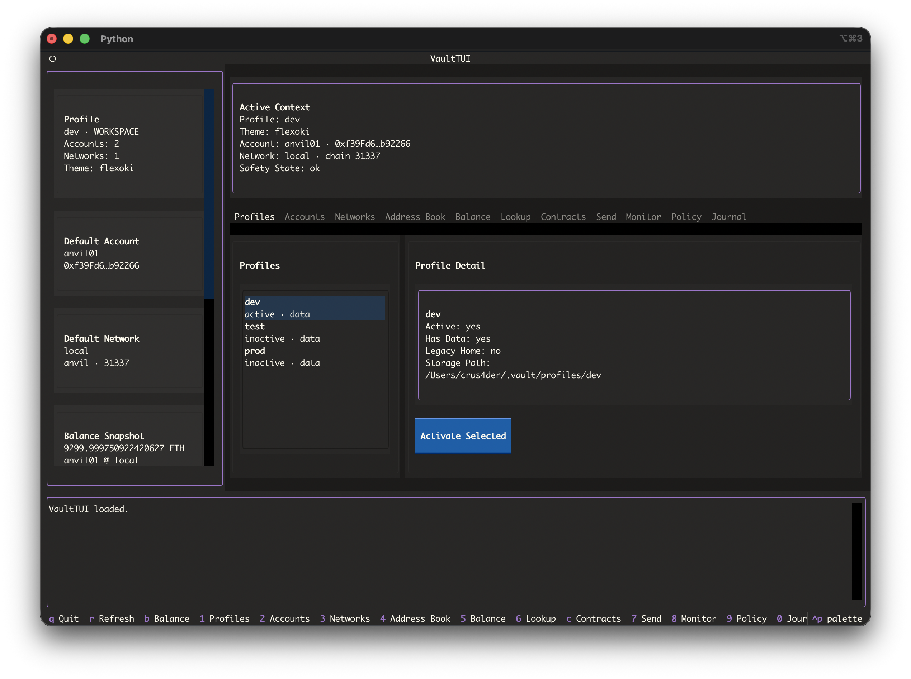
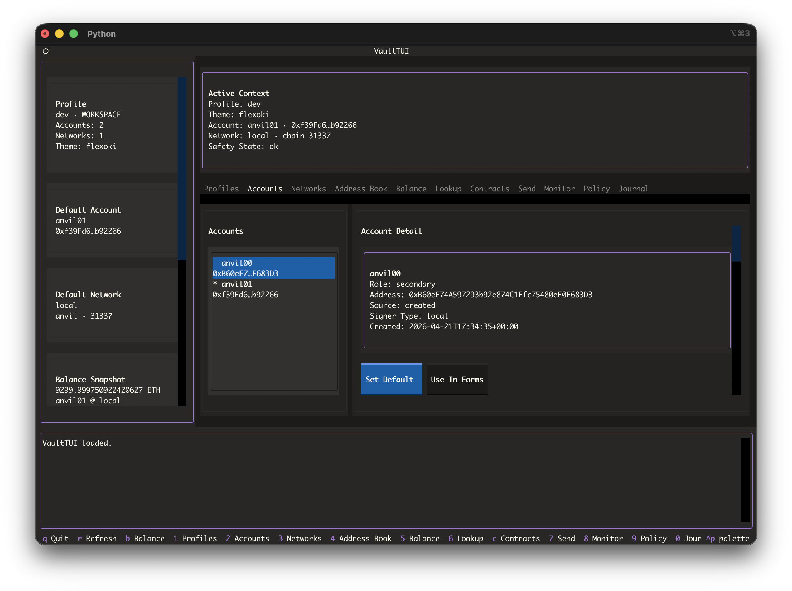
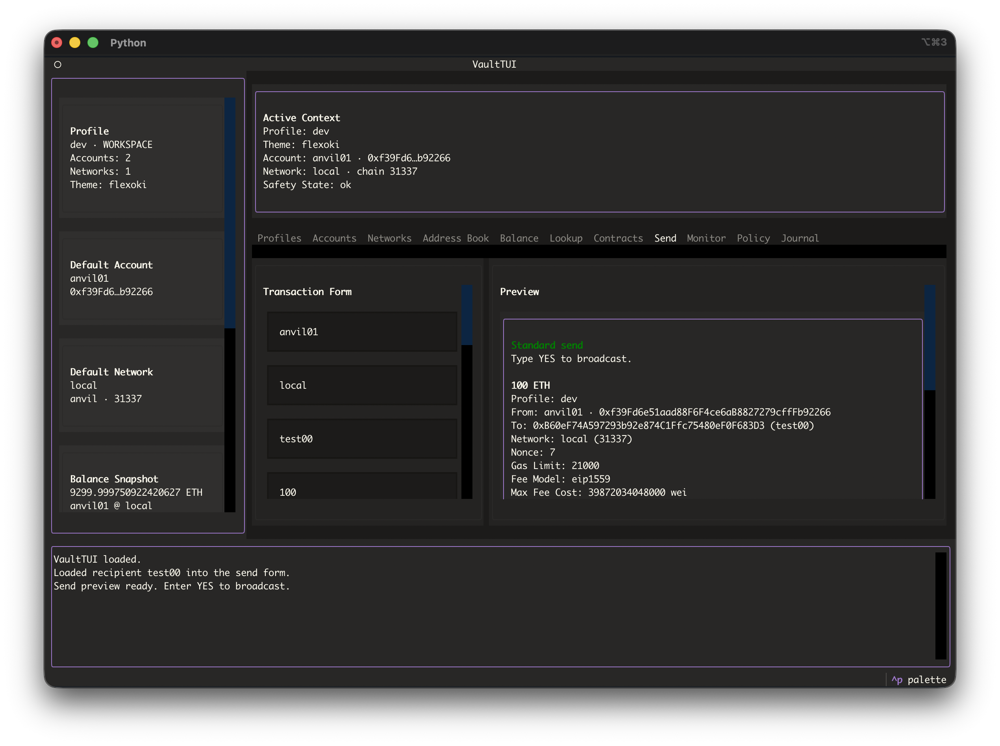

# vault

<p align="center">
  
</p>

Vault is a local-first EVM execution and wallet CLI/TUI focused on safe, observable transaction workflows.

It keeps keys and state on disk, separates `dev`/`test`/`prod` profiles, supports watch-only accounts, and focuses on safe transaction operations, policy checks, and observable wallet activity.

## Overview

Vault treats wallet actions as explicit, inspectable operations with enforced safety boundaries and local state.

- isolated `dev`, `test`, and `prod` profiles
- encrypted local keystore storage
- contract inspection, reads, and guarded writes
- transaction preview, simulation, journal, and monitoring
- CLI and TUI surfaces over the same service layer

## What It Does

- stores local signer keys in encrypted keystore files
- supports watch-only accounts
- separates `dev`, `test`, and `prod` profiles
- supports Alchemy presets, custom RPCs, and local Anvil networks
- fetches native and ERC-20 balances
- inspects addresses, token contracts, and generic contracts over RPC
- reads from contracts and prepares/simulates/executes contract writes with explicit ABI input
- signs messages and EIP-712 typed data
- previews, simulates, signs, and broadcasts EOA transactions
- applies outbound policy rules before protected actions
- records all actions and observed activity into a unified local journal
- monitors wallet activity and balance changes per account/network
- provides a Textual TUI for daily terminal use

## What It Does Not Do

- it does not manage account abstraction or smart-account lifecycles
- it is not a general automation platform
- it is not a chain indexer
- it is not portfolio or tax software
- it is not a substitute for a hardware wallet for larger funds

## Install

```bash
python3 -m venv venv
source venv/bin/activate
pip install -e .
```

## Safety Model

Profiles:

- `dev`: local Anvil and disposable work
- `test`: public testnets like Sepolia
- `prod`: real funds and intentional live actions

Rules:

- keep real funds in `prod`
- do daily development in `dev`
- use `test` for hosted RPC validation
- use `vault safety status` before changing a mixed store
- strong confirmation is required for protected send paths

## Storage

By default, `vault` stores data under `~/.vault`.

Each profile has its own store for:

- accounts
- networks
- address book
- policy
- journal
- monitor state
- theme

You can override the root with `VAULT_HOME`, but keep it outside any git repo or synced project folder:

```bash
export VAULT_HOME="$HOME/.vault-dev"
```

## Quick Start

Using Alchemy (public RPC):

```bash
export ALCHEMY_API_KEY="your-api-key"

vault network list-presets
vault network add-alchemy --preset eth-sepolia --name sepolia --set-default
vault doctor --network sepolia

vault account create --name main --set-default
vault balance --account main --network sepolia
```

Using a local Anvil network:

```bash
vault profile use --name dev
anvil

vault network add-anvil --name local --set-default
vault account import --name local-dev --private-key 0xANVIL_PRIVATE_KEY --set-default

vault doctor --network local
vault balance --account local-dev --network local
vault send --from-account local-dev --network local --to 0xANVIL_ADDRESS --amount 1
```

## Core Commands

Profiles:

```bash
vault profile list
vault profile show
vault profile use --name dev
vault safety status
```

Accounts:

```bash
vault account create --name main --set-default
vault account import --name signer --private-key 0x...
vault account watch --name treasury-observer --address 0xabc...
vault account list
vault account use --name main
```

Networks:

```bash
vault network list-presets
vault network add-alchemy --preset eth-mainnet --name mainnet
vault network add-anvil --name local --set-default
vault network add --name custom --rpc-url https://rpc.example --chain-id 1 --symbol ETH
vault network list
vault network use --name mainnet
```

Address book:

```bash
vault address-book add --name faucet --address 0xabc... --network sepolia
vault address-book list
vault address-book remove --name faucet
```

Balances and send:

```bash
vault balance --account main --network mainnet
vault lookup address --target main --network mainnet
vault lookup token --target 0xTOKEN --network mainnet --holder main
vault lookup contract --target 0xCONTRACT --network mainnet
vault contract read --target 0xCONTRACT --abi-file abi.json --function balanceOf --args "[\"0xabc...\"]"
vault contract write preview --target 0xCONTRACT --from-account main --abi-file abi.json --function setValue --args "[1]"
vault token allowance --token 0xTOKEN --owner main --spender router --network mainnet
vault token approve preview --token 0xTOKEN --from-account main --spender router --amount 1 --network mainnet
vault simulate --from-account main --network sepolia --to faucet --amount 0.01
vault send --from-account main --network sepolia --to faucet --amount 0.01
```

Signing:

```bash
vault sign-message --account main --message "hello from vault"
vault sign-typed-data --account main --file typed-data.json
```

Policy and journal:

```bash
vault policy list
vault policy show
vault policy set --rule blocked_networks --value mainnet
vault policy explain --account main --network sepolia --to faucet --amount 0.01

vault backup verify --account main
vault journal list
vault journal show --id 0x...
vault receipt show --tx-hash 0x...
```

The journal is the canonical local history for all wallet activity, including user actions and observed network events.

Monitoring:

```bash
vault monitor show-state --account main --network sepolia
vault monitor run --account main --network sepolia --once
vault monitor run --account main --network sepolia --interval 10
vault monitor list-events --account main --network sepolia --limit 20
```

The monitor polls over HTTP RPC and writes observed activity into the journal. The journal is the single user-facing history view for both user-initiated sends and monitor-written events.

## TUI

Launch:

```bash
vault ui
vault ui --profile dev
```

Current TUI areas:

- profiles
- accounts
- networks
- address book
- balance
- lookup
- contracts
- send
- monitor
- policy inspection and editing
- journal inspection and receipt lookup

## Screenshots







## Known Limits

- no hardware-wallet integration yet
- monitoring is polling-based in v1
- no websocket support
- no explorer-backed labels, verified ABIs, or transaction history for arbitrary addresses
- no explorer ABI fetching or signature inference for generic contract calls
- no chain-wide analytics or portfolio indexing
- token-balance observation is limited to what can already be inferred from observed activity

